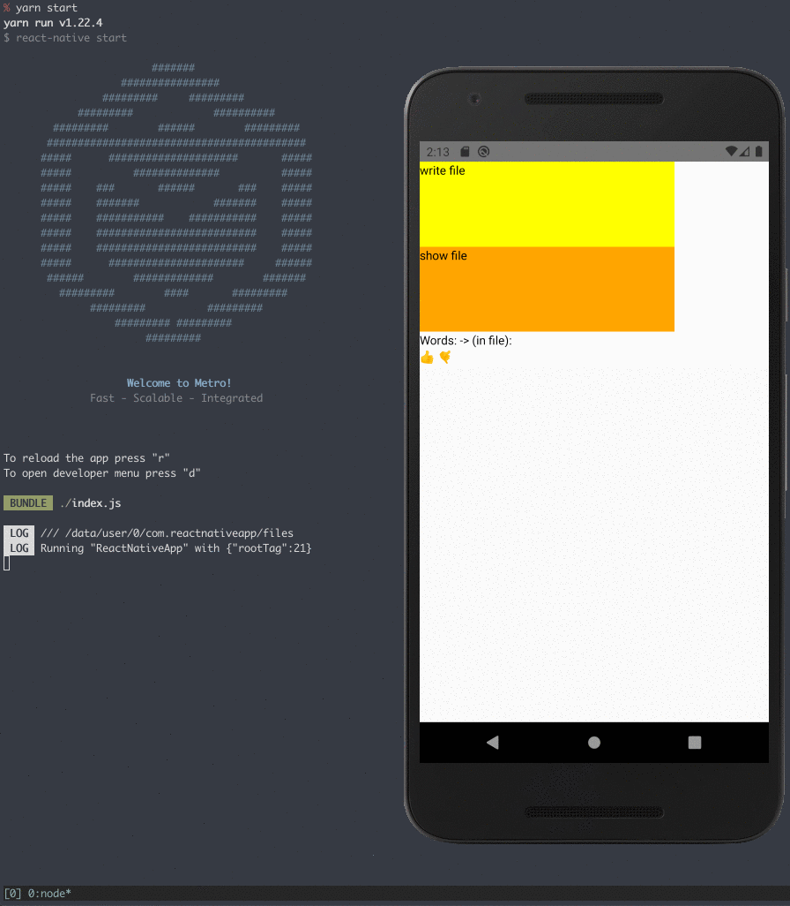

# yarn workspaces react-native / node.js app

## what do we have here?

Here is the same diagram, with conceptual groupings:

- `apps/`
  - [ReactNativeApp](./apps/ReactNativeApp/index.js)
  - [node-js-app](./apps/node-js-app/src/index.ts)
- `libraries/`
  - [__core__](./libraries/@calebgregory/core/src/app.ts)
    - is initialized and globalized by each of the apps individually
      - [__core-init-react-native__](./libraries/@calebgregory/core-init-react-native/src/init.ts)
      - [__core-init-node-js__](./libraries/@calebgregory/core-init-node-js/src/init.ts)
  - [file-toy](./libraries/@calebgregory/file-toy/src/do/file/read-write.ts)
    - uses `core/core().fs` to read and write a file
  - [components](./libraries/@calebgregory/components/src/index.tsx)
    - defines some react-native Components used by `ReactNativeApp`
  - [errors](./libraries/@calebgregory/errors/src/index.ts)
    - exports an extension of `Error`, which allows putting additional properties onto `Errors`

## why would i want this?

it allows you to write Javascript code with, effectively, an injected environment.

look at the [`file-toy` library](./libraries/@calebgregory/file-toy/src/do/file/read-write.ts).  This file `import[s] { core } from '@calebgregory/core'` and uses it without having any idea what it is.

here is that code running into two completely different runtimes:

### in a react-native app

### in a Node.js REPL

